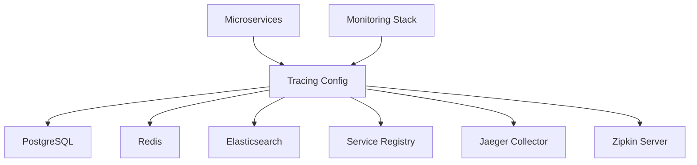

# Tracing Config - Operations Guide

## Overview

This operations guide provides comprehensive information for managing, monitoring, and maintaining the Tracing Configuration Service in production environments. It covers daily operations, incident response, maintenance procedures, and troubleshooting workflows.

## Service Overview

### Service Information
- **Service Name**: tracing-config
- **Namespace**: exalt-shared
- **Port**: 8093 (HTTP), 9090 (Metrics)
- **Health Check**: `/actuator/health`
- **Metrics Endpoint**: `/actuator/prometheus`
- **Log Level**: Configurable via `LOG_LEVEL` environment variable

### Service Dependencies


## Daily Operations

### 1. Health Monitoring

#### Service Health Check
```bash
# Basic health check
curl -f http://tracing-config.exalt.com/actuator/health

# Detailed health information
curl -s http://tracing-config.exalt.com/actuator/health | jq '.'
```

Expected healthy response:
```json
{
  "status": "UP",
  "components": {
    "db": {
      "status": "UP",
      "details": {
        "database": "PostgreSQL",
        "validationQuery": "isValid()"
      }
    },
    "redis": {
      "status": "UP",
      "details": {
        "version": "6.2.6"
      }
    },
    "diskSpace": {
      "status": "UP",
      "details": {
        "total": 107374182400,
        "free": 64424509440,
        "threshold": 10485760,
        "exists": true
      }
    }
  }
}
```

#### Kubernetes Health Monitoring
```bash
# Check pod status
kubectl get pods -n exalt-shared -l app=tracing-config

# Check service status
kubectl get svc tracing-config -n exalt-shared

# Check deployment status
kubectl get deployment tracing-config -n exalt-shared

# View recent events
kubectl get events -n exalt-shared --sort-by='.lastTimestamp' | grep tracing-config
```

### 2. Log Management

#### Accessing Logs
```bash
# View current logs
kubectl logs -f deployment/tracing-config -n exalt-shared

# View logs from specific pod
kubectl logs -f tracing-config-<pod-id> -n exalt-shared

# View logs from previous container (after restart)
kubectl logs --previous tracing-config-<pod-id> -n exalt-shared

# Follow logs from all replicas
kubectl logs -f -l app=tracing-config -n exalt-shared --all-containers=true
```

#### Log Analysis Queries (Elasticsearch/Kibana)
```json
// Find error logs in last 24 hours
{
  "query": {
    "bool": {
      "must": [
        {"match": {"kubernetes.labels.app": "tracing-config"}},
        {"range": {"@timestamp": {"gte": "now-24h"}}},
        {"match": {"level": "ERROR"}}
      ]
    }
  },
  "sort": [{"@timestamp": {"order": "desc"}}]
}

// Find high-latency requests
{
  "query": {
    "bool": {
      "must": [
        {"match": {"kubernetes.labels.app": "tracing-config"}},
        {"range": {"@timestamp": {"gte": "now-1h"}}},
        {"range": {"response_time": {"gte": 1000}}}
      ]
    }
  }
}
```

### 3. Performance Monitoring

#### Key Performance Indicators (KPIs)
```bash
# Check response time metrics
curl -s http://tracing-config.exalt.com/actuator/metrics/http.server.requests | jq '.measurements'

# Check JVM memory usage
curl -s http://tracing-config.exalt.com/actuator/metrics/jvm.memory.used | jq '.'

# Check database connection pool
curl -s http://tracing-config.exalt.com/actuator/metrics/hikaricp.connections.active | jq '.'

# Check cache hit ratio
curl -s http://tracing-config.exalt.com/actuator/metrics/cache.gets | jq '.'
```

#### Prometheus Queries
```promql
# Average response time over last 5 minutes
rate(http_request_duration_seconds_sum{job="tracing-config"}[5m]) / 
rate(http_request_duration_seconds_count{job="tracing-config"}[5m])

# Error rate percentage
rate(http_requests_total{job="tracing-config", status!~"2.."}[5m]) / 
rate(http_requests_total{job="tracing-config"}[5m]) * 100

# Memory usage percentage
jvm_memory_used_bytes{job="tracing-config"} / 
jvm_memory_max_bytes{job="tracing-config"} * 100

# Database connection pool utilization
hikaricp_connections_active{job="tracing-config"} / 
hikaricp_connections_max{job="tracing-config"} * 100
```

## Monitoring and Alerting

### 1. Critical Alerts

#### Service Availability
```yaml
# Alert when service is down
- alert: TracingConfigDown
  expr: up{job="tracing-config"} == 0
  for: 5m
  labels:
    severity: critical
    team: infrastructure
  annotations:
    summary: "Tracing Config service is down"
    description: "Tracing Config service has been down for more than 5 minutes"
    runbook: "https://wiki.exalt.com/runbooks/tracing-config-down"
```

#### High Error Rate
```yaml
# Alert when error rate exceeds 5%
- alert: TracingConfigHighErrorRate
  expr: |
    rate(http_requests_total{job="tracing-config", status!~"2.."}[5m]) / 
    rate(http_requests_total{job="tracing-config"}[5m]) * 100 > 5
  for: 10m
  labels:
    severity: warning
    team: infrastructure
  annotations:
    summary: "High error rate in Tracing Config service"
    description: "Error rate is {{ $value }}% for the last 10 minutes"
```

#### High Latency
```yaml
# Alert when P95 latency exceeds 500ms
- alert: TracingConfigHighLatency
  expr: |
    histogram_quantile(0.95, 
      rate(http_request_duration_seconds_bucket{job="tracing-config"}[5m])
    ) > 0.5
  for: 15m
  labels:
    severity: warning
    team: infrastructure
  annotations:
    summary: "High latency in Tracing Config service"
    description: "95th percentile latency is {{ $value }}s for 15 minutes"
```

### 2. Resource Alerts

#### Memory Usage
```yaml
# Alert when memory usage exceeds 85%
- alert: TracingConfigHighMemoryUsage
  expr: |
    jvm_memory_used_bytes{job="tracing-config"} / 
    jvm_memory_max_bytes{job="tracing-config"} * 100 > 85
  for: 10m
  labels:
    severity: warning
    team: infrastructure
  annotations:
    summary: "High memory usage in Tracing Config service"
    description: "Memory usage is {{ $value }}% for 10 minutes"
```

#### CPU Usage
```yaml
# Alert when CPU usage exceeds 80%
- alert: TracingConfigHighCPUUsage
  expr: |
    rate(process_cpu_seconds_total{job="tracing-config"}[5m]) * 100 > 80
  for: 10m
  labels:
    severity: warning
    team: infrastructure
  annotations:
    summary: "High CPU usage in Tracing Config service"
    description: "CPU usage is {{ $value }}% for 10 minutes"
```

### 3. Dependency Alerts

#### Database Connection Issues
```yaml
# Alert when database connections are running low
- alert: TracingConfigLowDBConnections
  expr: |
    hikaricp_connections_active{job="tracing-config"} / 
    hikaricp_connections_max{job="tracing-config"} * 100 > 90
  for: 5m
  labels:
    severity: warning
    team: infrastructure
  annotations:
    summary: "Low database connections available"
    description: "Database connection pool utilization is {{ $value }}%"
```

#### Redis Connection Issues
```yaml
# Alert when Redis is unreachable
- alert: TracingConfigRedisDown
  expr: redis_up{job="tracing-config"} == 0
  for: 2m
  labels:
    severity: critical
    team: infrastructure
  annotations:
    summary: "Redis connection failed for Tracing Config"
    description: "Redis has been unreachable for 2 minutes"
```

## Incident Response

### 1. Service Down Incident

#### Immediate Actions (0-5 minutes)
```bash
# 1. Verify the incident
curl -f http://tracing-config.exalt.com/actuator/health

# 2. Check pod status
kubectl get pods -n exalt-shared -l app=tracing-config

# 3. Check recent logs
kubectl logs --tail=100 deployment/tracing-config -n exalt-shared

# 4. Check for any recent deployments
kubectl rollout history deployment/tracing-config -n exalt-shared
```

#### Investigation Actions (5-15 minutes)
```bash
# 1. Check resource usage
kubectl top pods -n exalt-shared -l app=tracing-config

# 2. Check node status
kubectl get nodes

# 3. Check persistent volumes
kubectl get pv,pvc -n exalt-shared

# 4. Check events
kubectl describe deployment tracing-config -n exalt-shared
```

#### Recovery Actions
```bash
# Option 1: Restart pods
kubectl rollout restart deployment/tracing-config -n exalt-shared

# Option 2: Scale down and up
kubectl scale deployment tracing-config --replicas=0 -n exalt-shared
kubectl scale deployment tracing-config --replicas=2 -n exalt-shared

# Option 3: Rollback to previous version
kubectl rollout undo deployment/tracing-config -n exalt-shared

# Option 4: Emergency scale up
kubectl scale deployment tracing-config --replicas=5 -n exalt-shared
```

### 2. High Latency/Performance Issues

#### Investigation Checklist
```bash
# 1. Check current load
kubectl top pods -n exalt-shared -l app=tracing-config

# 2. Check database performance
psql -h postgres-service -U tracing_user -d tracing_config_db -c "
  SELECT query, calls, total_time, mean_time, rows
  FROM pg_stat_statements 
  ORDER BY mean_time DESC 
  LIMIT 10;"

# 3. Check Redis performance
redis-cli -h redis-service -p 6379 info stats

# 4. Check JVM garbage collection
curl -s http://tracing-config.exalt.com/actuator/metrics/jvm.gc.pause | jq '.'
```

#### Performance Optimization
```bash
# 1. Increase heap size
kubectl patch deployment tracing-config -n exalt-shared -p '
{
  "spec": {
    "template": {
      "spec": {
        "containers": [
          {
            "name": "tracing-config",
            "env": [
              {
                "name": "JAVA_OPTS",
                "value": "-Xms2g -Xmx4g -XX:+UseG1GC"
              }
            ]
          }
        ]
      }
    }
  }
}'

# 2. Scale horizontally
kubectl scale deployment tracing-config --replicas=5 -n exalt-shared

# 3. Update resource limits
kubectl patch deployment tracing-config -n exalt-shared -p '
{
  "spec": {
    "template": {
      "spec": {
        "containers": [
          {
            "name": "tracing-config",
            "resources": {
              "requests": {
                "cpu": "1000m",
                "memory": "2Gi"
              },
              "limits": {
                "cpu": "2000m",
                "memory": "4Gi"
              }
            }
          }
        ]
      }
    }
  }
}'
```

### 3. Database Issues

#### Database Connection Problems
```bash
# 1. Test database connectivity
kubectl run -it --rm debug --image=postgres:14 --restart=Never -- \
  psql -h postgres-service -U tracing_user -d tracing_config_db

# 2. Check database pod status
kubectl get pods -n infrastructure -l app=postgres

# 3. Check database logs
kubectl logs -f deployment/postgres -n infrastructure

# 4. Check connection pool status
curl -s http://tracing-config.exalt.com/actuator/metrics/hikaricp.connections
```

#### Database Performance Issues
```sql
-- Check slow queries
SELECT query, calls, total_time, mean_time, rows
FROM pg_stat_statements 
WHERE mean_time > 1000
ORDER BY mean_time DESC 
LIMIT 10;

-- Check database size
SELECT 
    schemaname,
    tablename,
    pg_size_pretty(pg_total_relation_size(schemaname||'.'||tablename)) as size
FROM pg_tables 
WHERE schemaname = 'public'
ORDER BY pg_total_relation_size(schemaname||'.'||tablename) DESC;

-- Check index usage
SELECT 
    indexrelname,
    idx_tup_read,
    idx_tup_fetch,
    idx_tup_read / NULLIF(idx_tup_fetch, 0) as ratio
FROM pg_stat_user_indexes
WHERE idx_tup_read > 0
ORDER BY ratio DESC;
```

## Maintenance Procedures

### 1. Scheduled Maintenance

#### Weekly Maintenance Tasks
```bash
# 1. Update configuration cache
curl -X POST http://tracing-config.exalt.com/api/v1/admin/cache/refresh \
  -H "Authorization: Bearer $ADMIN_TOKEN"

# 2. Clean up old traces (if applicable)
curl -X DELETE http://tracing-config.exalt.com/api/v1/admin/traces/cleanup?days=30 \
  -H "Authorization: Bearer $ADMIN_TOKEN"

# 3. Validate configuration integrity
curl -s http://tracing-config.exalt.com/api/v1/admin/config/validate \
  -H "Authorization: Bearer $ADMIN_TOKEN" | jq '.valid'

# 4. Update sampling strategies
kubectl apply -f k8s/configmap-updated.yaml
kubectl rollout restart deployment/tracing-config -n exalt-shared
```

#### Monthly Maintenance Tasks
```bash
# 1. Database maintenance
psql -h postgres-service -U tracing_user -d tracing_config_db -c "
  VACUUM ANALYZE tracing_configurations;
  VACUUM ANALYZE sampling_policies;
  REINDEX TABLE tracing_configurations;
"

# 2. Check and rotate logs
kubectl exec -it deployment/tracing-config -n exalt-shared -- \
  find /app/logs -name "*.log" -mtime +30 -delete

# 3. Update dependencies (security patches)
# Update base image and redeploy
docker pull openjdk:17-jre-slim
docker build -t exalt/tracing-config:$(date +%Y%m%d) .
```

### 2. Configuration Updates

#### Updating Sampling Strategies
```bash
# 1. Update ConfigMap
kubectl create configmap tracing-config-new \
  --from-file=sampling_strategies.json=config/sampling_strategies_new.json \
  -n exalt-shared --dry-run=client -o yaml | kubectl apply -f -

# 2. Rolling update
kubectl patch deployment tracing-config -n exalt-shared -p '
{
  "spec": {
    "template": {
      "metadata": {
        "annotations": {
          "config-hash": "'$(date +%s)'"
        }
      }
    }
  }
}'

# 3. Verify update
kubectl rollout status deployment/tracing-config -n exalt-shared
```

#### Dynamic Configuration Update
```javascript
// Update sampling rate for specific service
fetch('/api/v1/config/services/user-management', {
  method: 'PUT',
  headers: {
    'Authorization': 'Bearer ' + adminToken,
    'Content-Type': 'application/json'
  },
  body: JSON.stringify({
    samplingStrategy: {
      type: 'probabilistic',
      param: 0.05
    },
    exportConfig: {
      jaeger: { enabled: true },
      zipkin: { enabled: true }
    }
  })
});
```

### 3. Backup and Recovery

#### Database Backup
```bash
# Create backup
pg_dump -h postgres-service -U tracing_user -d tracing_config_db \
  --no-password --clean --create \
  > tracing-config-backup-$(date +%Y%m%d).sql

# Upload to S3
aws s3 cp tracing-config-backup-$(date +%Y%m%d).sql \
  s3://exalt-backups/tracing-config/

# Automated backup script
#!/bin/bash
BACKUP_FILE="tracing-config-backup-$(date +%Y%m%d-%H%M%S).sql"
pg_dump -h postgres-service -U tracing_user -d tracing_config_db > $BACKUP_FILE
aws s3 cp $BACKUP_FILE s3://exalt-backups/tracing-config/
rm $BACKUP_FILE
```

#### Configuration Backup
```bash
# Backup Kubernetes configurations
kubectl get configmap tracing-config -n exalt-shared -o yaml > config-backup.yaml
kubectl get secret tracing-secrets -n exalt-shared -o yaml > secrets-backup.yaml
kubectl get deployment tracing-config -n exalt-shared -o yaml > deployment-backup.yaml

# Store in git repository
git add config-backup.yaml deployment-backup.yaml
git commit -m "Backup tracing-config configuration $(date)"
git push origin main
```

#### Disaster Recovery
```bash
# 1. Restore database
psql -h postgres-service-new -U tracing_user -d postgres < tracing-config-backup.sql

# 2. Restore Kubernetes resources
kubectl apply -f config-backup.yaml
kubectl apply -f deployment-backup.yaml

# 3. Verify service health
kubectl get pods -n exalt-shared -l app=tracing-config
curl -f http://tracing-config.exalt.com/actuator/health
```

## Performance Tuning

### 1. JVM Tuning

#### Memory Configuration
```bash
# Optimal JVM settings for production
export JAVA_OPTS="
  -Xms2g
  -Xmx4g
  -XX:+UseG1GC
  -XX:MaxGCPauseMillis=200
  -XX:+UnlockExperimentalVMOptions
  -XX:+UseCGroupMemoryLimitForHeap
  -XX:+ExitOnOutOfMemoryError
  -XX:+HeapDumpOnOutOfMemoryError
  -XX:HeapDumpPath=/app/logs/heapdump.hprof
  -verbose:gc
  -XX:+PrintGCDetails
  -XX:+PrintGCTimeStamps
  -Xloggc:/app/logs/gc.log
"
```

#### Garbage Collection Monitoring
```bash
# Analyze GC logs
tail -f /app/logs/gc.log

# GC performance metrics
curl -s http://tracing-config.exalt.com/actuator/metrics/jvm.gc.pause | jq '
{
  "gc_pause_count": .measurements[0].value,
  "gc_pause_total_time": .measurements[1].value,
  "gc_pause_max": .measurements[2].value
}'
```

### 2. Database Optimization

#### Connection Pool Tuning
```yaml
spring:
  datasource:
    hikari:
      maximum-pool-size: 30        # Based on CPU cores * 2 + effective_spindle_count
      minimum-idle: 10             # Keep minimum connections ready
      connection-timeout: 30000    # 30 seconds
      idle-timeout: 600000         # 10 minutes
      max-lifetime: 1800000        # 30 minutes
      leak-detection-threshold: 60000  # 1 minute
      connection-test-query: "SELECT 1"
```

#### Database Query Optimization
```sql
-- Add indexes for frequently queried columns
CREATE INDEX CONCURRENTLY idx_tracing_config_service_enabled 
ON tracing_configurations (service_name, enabled) 
WHERE enabled = true;

CREATE INDEX CONCURRENTLY idx_sampling_policies_type_enabled 
ON sampling_policies (policy_type, enabled, priority) 
WHERE enabled = true;

-- Analyze query performance
EXPLAIN ANALYZE SELECT * FROM tracing_configurations 
WHERE service_name = 'user-management' AND enabled = true;
```

### 3. Cache Optimization

#### Redis Configuration
```yaml
spring:
  redis:
    timeout: 2000ms
    lettuce:
      pool:
        max-active: 16    # Maximum number of connections
        max-idle: 8       # Maximum idle connections
        min-idle: 4       # Minimum idle connections
        max-wait: 2000ms  # Maximum wait time for connection
```

#### Cache Strategy Implementation
```java
@Service
public class TracingConfigService {
    
    @Cacheable(value = "tracing-configs", key = "#serviceName")
    public TracingConfig getServiceConfiguration(String serviceName) {
        return configRepository.findByServiceName(serviceName);
    }
    
    @CacheEvict(value = "tracing-configs", key = "#serviceName")
    public void updateServiceConfiguration(String serviceName, TracingConfig config) {
        configRepository.save(config);
    }
    
    @Scheduled(fixedRate = 300000) // 5 minutes
    @CacheEvict(value = "tracing-configs", allEntries = true)
    public void refreshCache() {
        log.info("Cache refreshed");
    }
}
```

## Troubleshooting Guide

### 1. Common Issues

#### Issue: Service Returns 503 Service Unavailable
**Symptoms:**
- Health check fails
- Service responds with 503 status
- Logs show database connection errors

**Investigation:**
```bash
# Check database connectivity
kubectl exec -it deployment/tracing-config -n exalt-shared -- \
  nc -zv postgres-service 5432

# Check database pod status
kubectl get pods -n infrastructure -l app=postgres

# Check connection pool metrics
curl -s http://tracing-config.exalt.com/actuator/metrics/hikaricp.connections.active
```

**Resolution:**
```bash
# Restart database if needed
kubectl rollout restart deployment/postgres -n infrastructure

# Increase connection pool size temporarily
kubectl patch deployment tracing-config -n exalt-shared -p '
{
  "spec": {
    "template": {
      "spec": {
        "containers": [
          {
            "name": "tracing-config",
            "env": [
              {
                "name": "SPRING_DATASOURCE_HIKARI_MAXIMUM_POOL_SIZE",
                "value": "50"
              }
            ]
          }
        ]
      }
    }
  }
}'
```

#### Issue: High Memory Usage / OutOfMemoryError
**Symptoms:**
- Pods getting killed with OOMKilled status
- High memory usage alerts
- Application crashes

**Investigation:**
```bash
# Check memory usage
kubectl top pods -n exalt-shared -l app=tracing-config

# Get heap dump for analysis
kubectl exec -it deployment/tracing-config -n exalt-shared -- \
  jcmd 1 GC.run_finalization
kubectl exec -it deployment/tracing-config -n exalt-shared -- \
  jcmd 1 VM.classloader_stats
```

**Resolution:**
```bash
# Increase memory limits
kubectl patch deployment tracing-config -n exalt-shared -p '
{
  "spec": {
    "template": {
      "spec": {
        "containers": [
          {
            "name": "tracing-config",
            "resources": {
              "requests": {
                "memory": "2Gi"
              },
              "limits": {
                "memory": "4Gi"
              }
            },
            "env": [
              {
                "name": "JAVA_OPTS",
                "value": "-Xms2g -Xmx3g -XX:+UseG1GC"
              }
            ]
          }
        ]
      }
    }
  }
}'
```

### 2. Performance Issues

#### Issue: Slow Response Times
**Investigation Tools:**
```bash
# Application Performance Monitoring
curl -s http://tracing-config.exalt.com/actuator/metrics/http.server.requests | \
  jq '.measurements[] | select(.statistic == "TOTAL_TIME")'

# Database query analysis
psql -h postgres-service -U tracing_user -d tracing_config_db -c "
  SELECT query, calls, total_time, mean_time 
  FROM pg_stat_statements 
  WHERE mean_time > 100 
  ORDER BY mean_time DESC;"

# Thread dump analysis
kubectl exec -it deployment/tracing-config -n exalt-shared -- \
  jcmd 1 Thread.print > thread_dump.txt
```

#### Issue: Cache Miss Rate Too High
**Investigation:**
```bash
# Check cache statistics
curl -s http://tracing-config.exalt.com/actuator/metrics/cache.gets | jq '.'
curl -s http://tracing-config.exalt.com/actuator/metrics/cache.puts | jq '.'

# Redis connection status
redis-cli -h redis-service -p 6379 info replication
redis-cli -h redis-service -p 6379 info memory
```

### 3. Security Issues

#### Issue: Unauthorized Access
**Investigation:**
```bash
# Check recent authentication failures
kubectl logs deployment/tracing-config -n exalt-shared | \
  grep -i "authentication\|unauthorized\|forbidden"

# Verify JWT configuration
curl -s http://tracing-config.exalt.com/actuator/configprops | \
  jq '.security'
```

**Resolution:**
```bash
# Rotate JWT secret
kubectl patch secret tracing-secrets -n exalt-shared -p '
{
  "data": {
    "jwt-secret": "'$(echo -n "new-secure-jwt-secret" | base64)'"
  }
}'

# Restart pods to pick up new secret
kubectl rollout restart deployment/tracing-config -n exalt-shared
```

## Capacity Planning

### 1. Resource Planning

#### CPU and Memory Requirements
```bash
# Historical resource usage analysis
kubectl top pods -n exalt-shared -l app=tracing-config --use-protocol-buffers

# Calculate 95th percentile usage over time
# CPU: Base requirement + (Peak load * Safety factor)
# Memory: Base heap + Off-heap + Safety buffer

# Recommended resource allocation
requests:
  cpu: "500m"      # 0.5 CPU core
  memory: "1Gi"    # 1GB RAM
limits:
  cpu: "2000m"     # 2 CPU cores
  memory: "4Gi"    # 4GB RAM
```

#### Scaling Recommendations
```yaml
# Horizontal Pod Autoscaler configuration
apiVersion: autoscaling/v2
kind: HorizontalPodAutoscaler
metadata:
  name: tracing-config-hpa
spec:
  scaleTargetRef:
    apiVersion: apps/v1
    kind: Deployment
    name: tracing-config
  minReplicas: 2
  maxReplicas: 10
  metrics:
  - type: Resource
    resource:
      name: cpu
      target:
        type: Utilization
        averageUtilization: 70
  - type: Resource
    resource:
      name: memory
      target:
        type: Utilization
        averageUtilization: 80
  behavior:
    scaleDown:
      stabilizationWindowSeconds: 300
      policies:
      - type: Percent
        value: 50
        periodSeconds: 60
    scaleUp:
      stabilizationWindowSeconds: 60
      policies:
      - type: Percent
        value: 100
        periodSeconds: 15
```

### 2. Database Capacity Planning

```sql
-- Monitor database growth
SELECT 
    schemaname,
    tablename,
    pg_size_pretty(pg_relation_size(schemaname||'.'||tablename)) as table_size,
    pg_size_pretty(pg_total_relation_size(schemaname||'.'||tablename)) as total_size
FROM pg_tables 
WHERE schemaname = 'public'
ORDER BY pg_total_relation_size(schemaname||'.'||tablename) DESC;

-- Estimate future storage needs
WITH monthly_growth AS (
    SELECT 
        DATE_TRUNC('month', created_at) as month,
        COUNT(*) as records
    FROM tracing_configurations
    WHERE created_at >= NOW() - INTERVAL '6 months'
    GROUP BY DATE_TRUNC('month', created_at)
    ORDER BY month
)
SELECT 
    month,
    records,
    LAG(records) OVER (ORDER BY month) as prev_month,
    (records - LAG(records) OVER (ORDER BY month)) as growth
FROM monthly_growth;
```

## Security Operations

### 1. Security Monitoring

#### Security Event Monitoring
```bash
# Monitor failed authentication attempts
kubectl logs deployment/tracing-config -n exalt-shared | \
  grep -i "authentication failed\|unauthorized" | \
  tail -20

# Check for suspicious IP addresses
kubectl logs deployment/tracing-config -n exalt-shared | \
  grep -E "([0-9]{1,3}\.){3}[0-9]{1,3}" | \
  sort | uniq -c | sort -nr | head -10
```

#### SSL/TLS Certificate Management
```bash
# Check certificate expiration
openssl x509 -in /app/certs/tracing-config.crt -text -noout | \
  grep -A 2 "Validity"

# Automated certificate renewal (if using cert-manager)
kubectl get certificates -n exalt-shared
kubectl describe certificate tracing-config-tls -n exalt-shared
```

### 2. Access Control Management

#### Role-Based Access Control (RBAC)
```bash
# Review current permissions
kubectl auth can-i --list --as=system:serviceaccount:exalt-shared:tracing-config-sa

# Check service account permissions
kubectl describe serviceaccount tracing-config-sa -n exalt-shared
kubectl describe role tracing-config-role -n exalt-shared
```

## Documentation and Knowledge Management

### 1. Runbook Templates

#### Incident Response Template
```markdown
## Incident: [Brief Description]
**Date:** [YYYY-MM-DD]
**Severity:** [Critical/High/Medium/Low]
**Status:** [Investigating/Mitigating/Resolved]

### Timeline
- [HH:MM] Issue detected
- [HH:MM] Investigation started
- [HH:MM] Root cause identified
- [HH:MM] Fix implemented
- [HH:MM] Service restored

### Root Cause
[Detailed explanation of what caused the incident]

### Resolution
[Steps taken to resolve the issue]

### Prevention
[Actions to prevent similar incidents]

### Lessons Learned
[Key takeaways and improvements]
```

### 2. Operational Checklists

#### Daily Health Check Checklist
- [ ] Service health endpoint responding
- [ ] All pods running and ready
- [ ] No critical alerts firing
- [ ] Database connectivity confirmed
- [ ] Redis connectivity confirmed
- [ ] Response times within SLA
- [ ] Error rates below threshold
- [ ] Resource usage within limits

#### Weekly Maintenance Checklist
- [ ] Review and acknowledge alerts
- [ ] Check log retention policies
- [ ] Validate backup integrity
- [ ] Review security patches
- [ ] Update documentation
- [ ] Performance trend analysis
- [ ] Capacity planning review

---

## Emergency Contacts

### Escalation Path
1. **Level 1**: Infrastructure Team (infrastructure-team@exalt.com)
2. **Level 2**: Platform Engineering Lead
3. **Level 3**: CTO/Engineering Director

### Communication Channels
- **Slack**: #infrastructure-alerts
- **PagerDuty**: Infrastructure Service
- **Phone**: Emergency hotline (available in internal documentation)

---

*This operations guide is maintained by the Shared Infrastructure Team. Last updated: {{ current_date }}*
*For updates or questions, contact: infrastructure-team@exalt.com*