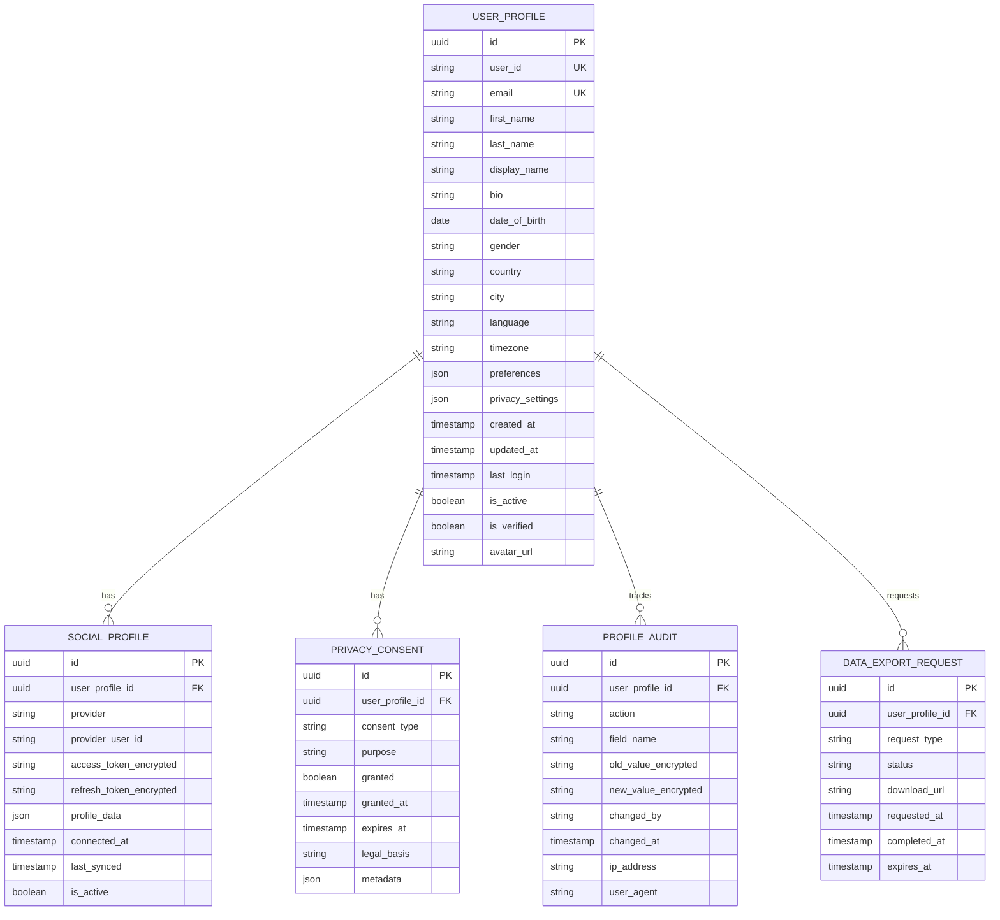

# User Profile Service - Architecture Documentation

## Overview

The User Profile Service is a critical shared infrastructure component within the Exalt Social E-commerce Ecosystem, responsible for comprehensive user profile management, privacy compliance, and data aggregation across multiple platforms and services.

## Architecture Overview

### Service Architecture

```
┌─────────────────────────────────────────────────────────────┐
│                    User Profile Service                     │
├─────────────────────────────────────────────────────────────┤
│  ┌─────────────┐  ┌─────────────┐  ┌─────────────────────┐  │
│  │  REST API   │  │   OAuth2    │  │   Privacy Manager   │  │
│  │ Controllers │  │Integration  │  │   (GDPR/CCPA)       │  │
│  └─────────────┘  └─────────────┘  └─────────────────────┘  │
├─────────────────────────────────────────────────────────────┤
│  ┌─────────────┐  ┌─────────────┐  ┌─────────────────────┐  │
│  │   Profile   │  │   Search    │  │   File Storage      │  │
│  │   Service   │  │   Service   │  │   Integration       │  │
│  └─────────────┘  └─────────────┘  └─────────────────────┘  │
├─────────────────────────────────────────────────────────────┤
│  ┌─────────────┐  ┌─────────────┐  ┌─────────────────────┐  │
│  │ PostgreSQL  │  │    Redis    │  │   Elasticsearch     │  │
│  │  (Primary)  │  │  (Cache)    │  │     (Search)        │  │
│  └─────────────┘  └─────────────┘  └─────────────────────┘  │
└─────────────────────────────────────────────────────────────┘
```

### Core Components

#### 1. User Profile Management

- **Profile Entity Management**: Comprehensive user profile data including personal information, preferences, and settings
- **Multi-Platform Integration**: Support for social media profile aggregation (Facebook, Google, Twitter, LinkedIn)
- **Avatar & Media Management**: Profile image processing and storage with AWS S3 integration
- **Profile Versioning**: Audit trail and version history for compliance and data integrity

#### 2. Privacy & Compliance Engine

- **GDPR Compliance**: Data subject rights including access, rectification, erasure, and portability
- **CCPA Compliance**: California privacy rights and opt-out mechanisms
- **Consent Management**: Granular consent tracking and preference management
- **Data Anonymization**: PII anonymization and pseudonymization capabilities
- **Audit Logging**: Comprehensive audit trails for all data operations

#### 3. Social Integration Layer

- **OAuth2 Provider Integration**: 
  - Facebook Graph API
  - Google Identity Platform
  - Twitter API v2
  - LinkedIn API
- **Profile Aggregation**: Automated profile data synchronization
- **Social Graph Mapping**: Connection and relationship management
- **Privacy-First Integration**: Minimal data collection with user consent

#### 4. Search & Discovery

- **Elasticsearch Integration**: Full-text search capabilities
- **Profile Indexing**: Real-time profile data indexing
- **Privacy-Aware Search**: Search results respecting privacy settings
- **Advanced Filtering**: Multi-criteria profile filtering

## Data Architecture

### Database Design

#### Core Entities



### Data Classification

#### Personal Data Categories

1. **Identity Data**
   - Names, email addresses, usernames
   - Government identifiers (encrypted)
   - Biometric data (hashed)

2. **Contact Information**
   - Phone numbers, addresses
   - Emergency contacts
   - Communication preferences

3. **Demographic Data**
   - Age, gender, nationality
   - Language preferences
   - Cultural identifiers

4. **Behavioral Data**
   - Login patterns
   - Feature usage statistics
   - Interaction preferences

5. **Social Data**
   - Social media profiles
   - Connection graphs
   - Social preferences

## Security Architecture

### Authentication & Authorization

- **JWT Token Management**: Secure token generation and validation
- **OAuth2 Integration**: Industry-standard social login
- **Multi-Factor Authentication**: Optional 2FA support
- **Session Management**: Secure session handling with Redis

### Data Protection

- **Encryption at Rest**: AES-256 encryption for sensitive data
- **Encryption in Transit**: TLS 1.3 for all communications
- **Key Management**: AWS KMS integration for key rotation
- **Tokenization**: PII tokenization for reduced exposure

### Privacy by Design

- **Data Minimization**: Collect only necessary data
- **Purpose Limitation**: Data used only for stated purposes
- **Storage Limitation**: Automated data retention policies
- **Pseudonymization**: User identifiers separated from personal data

## Integration Architecture

### External Service Integration

#### Authentication Services
- **Identity Provider**: OAuth2/OpenID Connect integration
- **Multi-Factor Authentication**: TOTP and SMS-based 2FA
- **Single Sign-On**: SAML 2.0 support for enterprise customers

#### File Storage Services
- **AWS S3**: Profile avatars and document storage
- **CloudFront CDN**: Global content delivery
- **Image Processing**: Thumbnailator for image optimization

#### Notification Services
- **Email Service**: Profile-related notifications
- **Push Notifications**: Mobile app integration
- **SMS Service**: Security-related communications

#### Compliance Services
- **KYC Service**: Identity verification integration
- **Legal Document Service**: Terms and privacy policy management
- **Audit Service**: Centralized audit logging

### Event-Driven Architecture

#### Domain Events

```java
// Profile Events
UserProfileCreatedEvent
UserProfileUpdatedEvent
UserProfileDeletedEvent
UserProfileMergedEvent

// Privacy Events
ConsentGrantedEvent
ConsentRevokedEvent
DataExportRequestedEvent
DataDeletionRequestedEvent

// Social Events
SocialProfileConnectedEvent
SocialProfileDisconnectedEvent
SocialDataSyncedEvent
```

#### Event Streaming

- **Apache Kafka**: Event streaming backbone
- **Event Sourcing**: Complete audit trail
- **CQRS Pattern**: Separated read/write models
- **Saga Pattern**: Distributed transaction management

## Performance Architecture

### Caching Strategy

#### Multi-Level Caching

1. **Application Cache**: In-memory caching with Caffeine
2. **Redis Cache**: Distributed caching layer
3. **Database Cache**: PostgreSQL query result caching
4. **CDN Cache**: Static content delivery

#### Cache Invalidation

- **Event-Driven Invalidation**: Cache updates via domain events
- **TTL-Based Expiration**: Time-based cache expiration
- **Manual Invalidation**: Administrative cache management
- **Write-Through Caching**: Immediate cache updates

### Search Performance

#### Elasticsearch Optimization

- **Index Sharding**: Horizontal scaling across nodes
- **Custom Analyzers**: Language-specific text analysis
- **Aggregation Optimization**: Pre-calculated metrics
- **Real-Time Indexing**: Near real-time search updates

### Database Performance

#### Query Optimization

- **Connection Pooling**: HikariCP for efficient connections
- **Read Replicas**: Separated read/write workloads
- **Query Optimization**: Indexed queries and efficient joins
- **Batch Processing**: Bulk operations for performance

## Compliance Architecture

### GDPR Compliance

#### Data Subject Rights

1. **Right to Access**: Comprehensive data export functionality
2. **Right to Rectification**: Profile update and correction tools
3. **Right to Erasure**: Secure data deletion with audit trails
4. **Right to Portability**: Standardized data export formats
5. **Right to Object**: Granular processing objection handling

#### Technical Measures

- **Data Protection Impact Assessment**: Built-in DPIA tools
- **Privacy by Design**: Privacy-first architecture
- **Data Minimization**: Automated data lifecycle management
- **Consent Management**: Granular consent tracking

### CCPA Compliance

#### Consumer Rights

1. **Right to Know**: Transparent data collection disclosure
2. **Right to Delete**: Consumer data deletion requests
3. **Right to Opt-Out**: Sale of personal information opt-out
4. **Right to Non-Discrimination**: Equal service regardless of privacy choices

#### Technical Implementation

- **Do Not Sell Flag**: Global privacy control support
- **Consumer Request Portal**: Self-service privacy tools
- **Third-Party Data Sharing Controls**: Granular sharing permissions
- **Automated Compliance Reporting**: Regular compliance audits

## Monitoring & Observability

### Application Monitoring

- **Metrics Collection**: Micrometer with Prometheus
- **Health Checks**: Spring Boot Actuator endpoints
- **Performance Monitoring**: JVM and application metrics
- **Custom Business Metrics**: Profile-specific KPIs

### Security Monitoring

- **Access Pattern Analysis**: Behavioral anomaly detection
- **Failed Authentication Tracking**: Brute force detection
- **Data Access Auditing**: Comprehensive access logging
- **Privacy Violation Detection**: Automated compliance monitoring

### Compliance Monitoring

- **Consent Expiration Tracking**: Automated consent renewal
- **Data Retention Monitoring**: Automated data lifecycle management
- **Export Request Tracking**: GDPR/CCPA request monitoring
- **Audit Trail Completeness**: Continuous audit verification

## Deployment Architecture

### Container Strategy

- **Multi-Stage Builds**: Optimized Docker images
- **Security Hardening**: Non-root user execution
- **Health Checks**: Container health monitoring
- **Resource Limits**: CPU and memory constraints

### Kubernetes Deployment

- **High Availability**: Multi-replica deployment
- **Auto-Scaling**: HPA based on CPU/memory metrics
- **Rolling Updates**: Zero-downtime deployments
- **Service Mesh**: Istio for traffic management

### Environment Strategy

- **Development**: Local development with Docker Compose
- **Staging**: Kubernetes staging environment
- **Production**: Multi-zone production deployment
- **Disaster Recovery**: Cross-region backup strategy

## Future Architecture Considerations

### Scalability Enhancements

- **Microservice Decomposition**: Further service splitting
- **Event Sourcing Migration**: Complete event-driven architecture
- **Polyglot Persistence**: Specialized databases for specific use cases
- **Serverless Integration**: Function-as-a-Service for specific operations

### Advanced Privacy Features

- **Homomorphic Encryption**: Computation on encrypted data
- **Differential Privacy**: Mathematical privacy guarantees
- **Zero-Knowledge Proofs**: Privacy-preserving verification
- **Federated Learning**: Decentralized machine learning

### Next-Generation Integration

- **GraphQL Federation**: Unified API gateway
- **Blockchain Integration**: Decentralized identity management
- **AI/ML Integration**: Intelligent profile recommendations
- **Edge Computing**: Distributed profile processing

---

**Document Version**: 1.0.0  
**Last Updated**: 2024-06-25  
**Document Owner**: Exalt Application Limited - Architecture Team  
**Review Cycle**: Quarterly